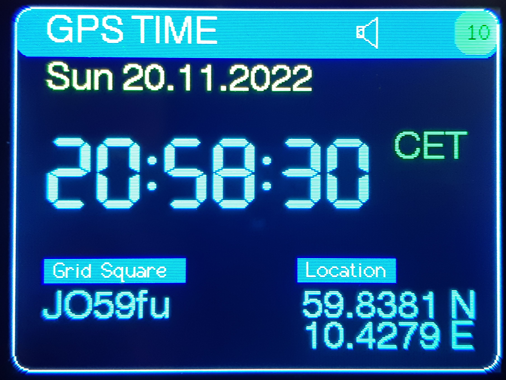
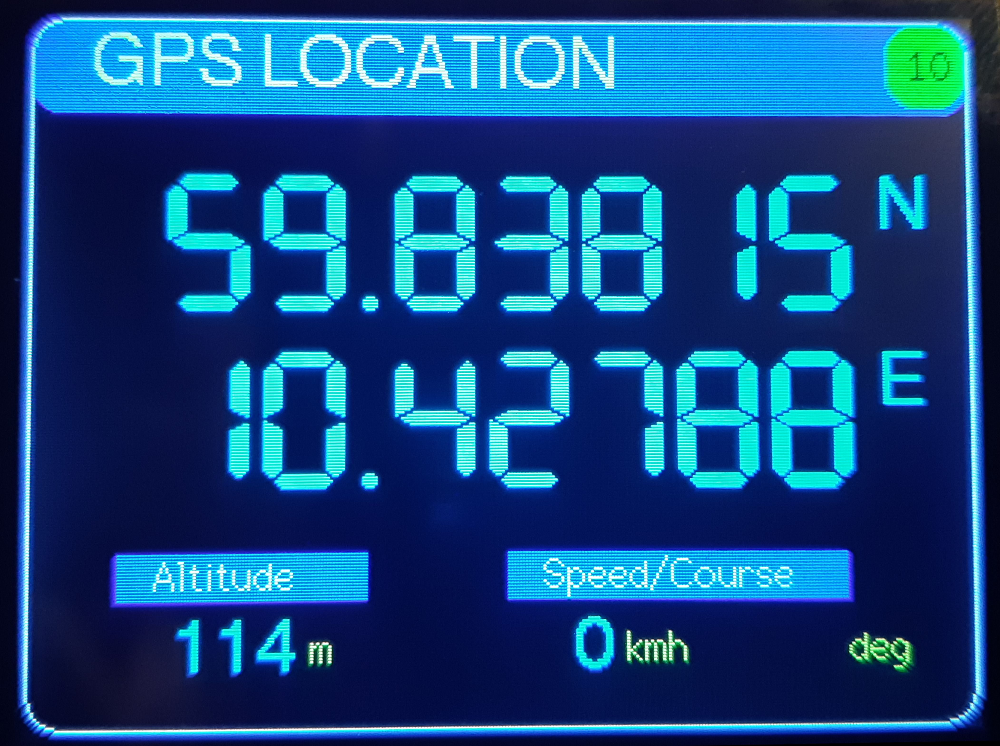
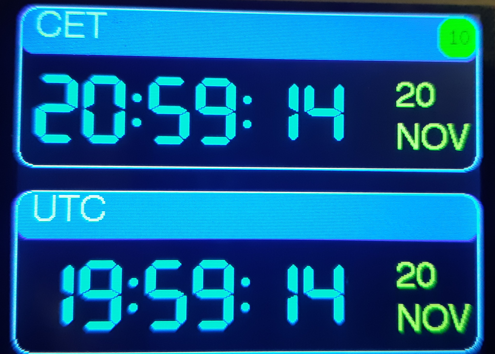

# GPS clock
## Cloned triple version
### EU option
Backwards compatible version which can be Europeanized with formats for date and units. It also has possibility for removing battery icon, when run from a USB supply. 

New boolean variables to set:
1. US_UNITS - if false: m, kmh, Little-endian date with '.' (example: 20.11.2022), if true: feet, mph, Middle-Endian date with '/' (example: 11/20/2022)
2. BATTERY_DISPLAY - true: as original code, false: no display of battery icon and status

### Fixes
1. New way of initializing Serial1 as the original one didn't compile in Arduino IDE 1.8.13. See [https://github.com/stm32duino/wiki/wiki/API#hardwareserial](https://github.com/stm32duino/wiki/wiki/API#hardwareserial)
2. The satellite count in the upper right corner is more agile so it now drops to 0 when GPS signal is lost, rather than stay forever at last satellite count.

### Images

## Original write-up
 
This is an Arduino-based digital clock using a GPS module, Blue-Pill microcontroller, and ILI9341 TFT display.  Accuracy is within a few microseconds.  See w8bh.net for details and step-by-step explanation.
 
